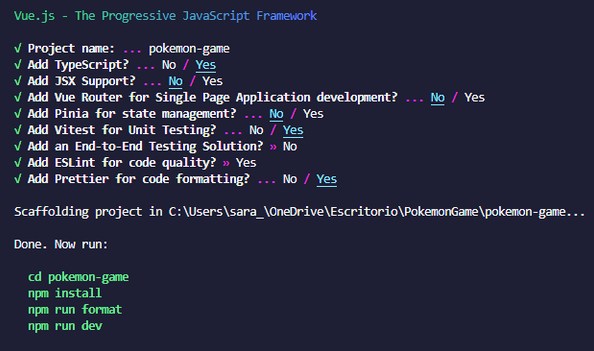
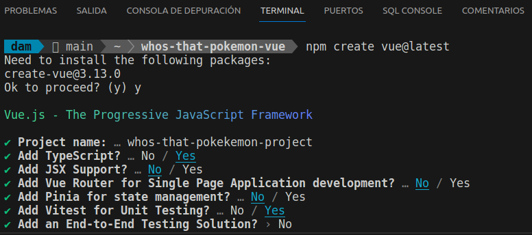
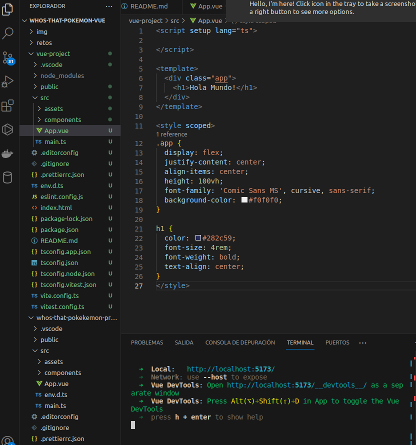
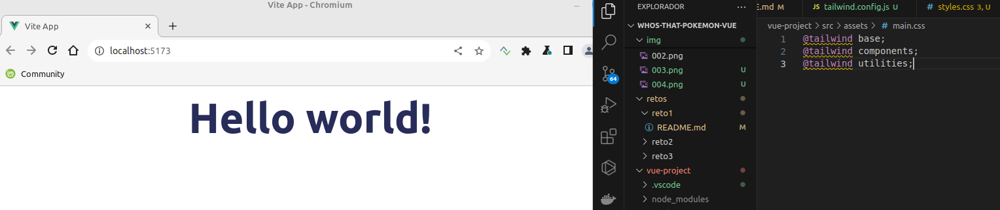

## Reto 1

<div align="center">
    
    
    
    
</div>

---------

En este primer reto debemos realizar los primeros pasos de cualquier inicio de proyecto:

1. Crea y configura tu repositorio de Github para la aplicación.

    ¡IMPORTANTE! Todo lo que vayas haciendo deberá quedar reflejado en el README de tu repositorio, por tanto, no olvides de ir sacando capturas de todos los pasos que vayas realizando para adjuntarlas en este archivo.

2. Crea un proyecto en VueJS:

    Vamos a crear un proyecto en VueJS, y para ello, vamos a usar el comando desde nuestra terminal: 
```bash
npm create vue@latest 
```

A continuación, VueJS nos preguntará que configuraciónqueremos en nuestro proyecto, que será la siguiente:



📁 _¿Para qué sirve Vue Router, Pinia, Vitest, ESLint y Prettier?_

__Respuesta:__ 

### Vue Router

Vue Router es la solución oficial de enrutamiento para aplicaciones creadas con Vue.js. Permite:

* Crear y gestionar rutas en una aplicación de una sola página (SPA).

* Navegar entre diferentes vistas sin recargar la página completa.

* Definir rutas dinámicas con parámetros (por ejemplo, /planta/:id).

* Implementar características como la navegación programática, protección de rutas (guardias de navegación) y transiciones animadas entre vistas.

### Pinia
Pinia es la biblioteca oficial para gestionar el estado global en aplicaciones Vue.js. Es el sucesor de Vuex y ofrece una API más simple e intuitiva. Sus principales ventajas son:

* Sincronización de datos entre componentes.

* Soporte para composición de stores, permitiendo dividir el estado en módulos.

* Mejor rendimiento y compatibilidad con TypeScript.

* Persistencia del estado a través de extensiones o plugins.

### Vitest

Vitest es una herramienta de pruebas unitarias para aplicaciones de JavaScript y TypeScript. Se integra perfectamente con el ecosistema de Vue y Vite. Proporciona:

* Pruebas rápidas gracias a su compatibilidad con Vite.

* Soporte para pruebas de componentes y funciones.

* Un entorno moderno con funcionalidades como módulos simulados (mocking) y snapshots.

* Integración con bibliotecas populares como Testing Library.

### ESLint

ESLint es una herramienta para analizar y corregir el código de JavaScript y Vue.js. Ayuda a mantener un estilo de código consistente y a evitar errores comunes mediante:

* Reglas configurables para el formato del código.

* Identificación de problemas potenciales antes de ejecutar el código.

* Integración con editores de texto para mostrar errores en tiempo real.

* Compatibilidad con plugins y configuraciones personalizadas.

### Prettier

Prettier es una herramienta de formateo de código automática que garantiza un estilo consistente en todo el proyecto. Sus ventajas incluyen:

* Formateo automático al guardar archivos.

* Evitar discusiones sobre estilo de código en el equipo.

* Compatibilidad con ESLint para resolver conflictos entre reglas.

* Soporte para diferentes lenguajes y frameworks, como HTML, CSS y JavaScript.


--------------------------

Ahora ejecutamos el comando del principio:

__Output:__



Nuestro Pokemon Game lo vamos a realizar siguiendo __Composition API__ y además, nuestra estructura de archivos va a estar basada en _screaming architecture._

📁 _¿Qué es Composition API y en qué se diferencia de Option API en VueJS?_


__La Composition API__ es una forma más flexible y moderna de escribir componentes en Vue.js. Te permite organizar la lógica del componente en funciones reutilizables que puedes importar, mezclar y usar en diferentes componentes. En lugar de agrupar todo por opciones (como data, methods, computed, etc.), agrupa las partes lógicas relacionadas en bloques dentro de una única función, llamada setup.


__La Option API__ es la forma más tradicional de escribir componentes en Vue. Organizas el código usando "secciones" o "opciones" predefinidas como data, methods, computed, watch, etc. Cada cosa tiene su sitio bien marcado, y Vue se encarga de unirlo todo para que funcione como un componente.

Es como seguir un esquema bien organizadito que Vue te da

| **Aspecto**                 | **Option API**                               | **Composition API**                                    |
|-----------------------------|---------------------------------------------|-------------------------------------------------------|
| **Organización**            | Por opciones (`data`, `methods`, etc.)      | Por funcionalidades dentro de `setup`                |
| **Flexibilidad**            | Estructura fija                             | Muy flexible: puedes reutilizar lógica fácilmente     |
| **Escalabilidad**           | Puede volverse complicado en componentes grandes | Más limpia para proyectos grandes                    |
| **Reutilización**           | Difícil reutilizar lógica compleja          | Reutilización sencilla con funciones y composables    |
| **Aprendizaje**             | Más fácil de aprender (ideal para principiantes) | Más avanzado (necesita conocer JavaScript más a fondo) |
| **Tipos de proyectos**      | Ideal pa proyectos pequeños o simples       | Ideal para proyectos grandes y aplicaciones complejas   |

------------

Ejemplo práctico

__Option API:__

```javascript
export default {
  data() {
    return {
      count: 0,
    };
  },
  methods: {
    increment() {
      this.count++;
    },
  },
};
```

__Composition API:__

```javascript
import { ref } from 'vue';

export default {
  setup() {
    const count = ref(0);

    function increment() {
      count.value++;
    }

    return { count, increment };
  },
};
```

❓ __¿Cuál usar?__

Si el proyecto es pequeñito o eres nuevo en Vue: la Option API sigue siendo estupenda porque es fácil de entender y directa.

Si el proyecto tiene mucha lógica compartida o se hace más grande: la Composition API es la mejor opción, ya que te ayuda a organizar el código de forma más clara y reutilizable.


📁 _¿Qué es screaming architecture y qué ventajas tiene?_

La Screaming Architecture es un concepto introducido por Robert C. Martin (también conocido como Uncle Bob) en su libro "Clean Architecture". La idea principal es que la arquitectura de tu aplicación "grite" (scream) cuál es su propósito principal. Es decir, si alguien mira el diseño o la estructura de carpetas de tu proyecto, debe entender de inmediato de qué trata tu sistema y cuál es su propósito, sin necesidad de profundizar demasiado.

Por ejemplo:

    En un proyecto sobre gestión de reservas de restaurantes, la estructura debería resaltar términos como Reservas, Mesas, Clientes, Restaurantes.
    En un proyecto de juegos, términos como Personajes, Niveles y Puntuaciones deberían ser obvios.

El objetivo es que la funcionalidad principal del sistema sea evidente con solo echar un vistazo.

---------------------

__Práctica:__ 
Ahora, vamos a modificar y borrar todo lo que no necesitamos que nos ha creado de forma automática VueJS: 

    El contenido de App.vue y deja la estructura básica de VueJS teniendo en cuenta que usaremos Composition API. Recuerda que vamos a utilizar TS en lugar de JS, ¿cómo se lo indicamos a Vue?
    Añade un mensaje de Hola mundo en App.vue
    En la carpeta de assets, borra los archivos base.css y logo.svg
    Cambia el nombre de main.css de la carpeta assets a styles.css y modifica la ruta en el archivo main.ts para que funcione correctamente nuestra hoja de estilo.
    Ejecuta el comando npm run dev y muestra el resultado.




_Configura el proyecto para hacer uso de Tailwind CSS. Consulta la documentación oficial y aplica los cambios donde sea necesario tal y como se indica._


