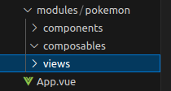
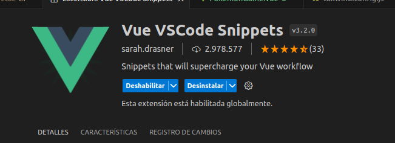
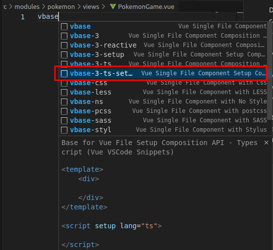
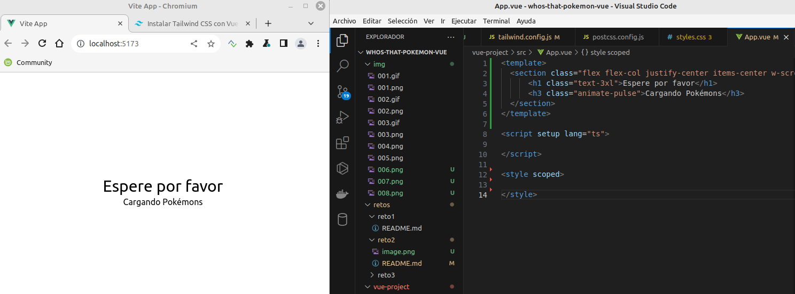
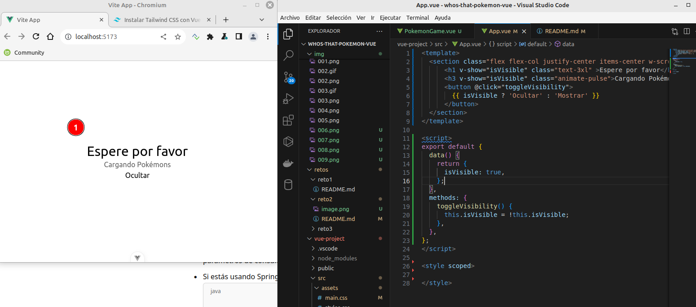
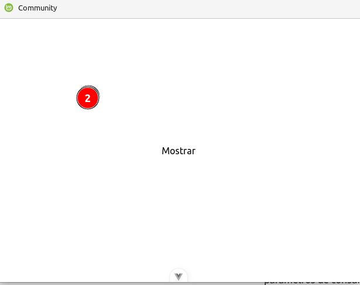

## Reto 2

    
    
    
    

----------

### Screaming Architecture 

En programación, "screaming architecture" es un concepto que se refiere al diseño de una arquitectura de software en la que la estructura y los elementos principales del sistema dejan claro el propósito del mismo. La idea es que, al observar la estructura del código, los nombres de las carpetas, los módulos o las clases, sea evidente qué hace el sistema o cuál es su propósito principal.

    Sin miedo, borramos por completo la carpeta de components.
    Crea una nueva carpeta dentro de src llamada modules, y dentro de esta una llamada pokemon, de tal forma que tendríamos src/modules/pokemon.

Dentro de la carpeta de pokemon vamos a tener todos los archivos que estén relacionados con nuestro juego de pokemon. La mayor parte de nuestro código irá dentro de esta carpeta.

    Creamos una nueva carpeta llamada composables, 

_❓¿qué es un composable en VueJS y cual es la nomenclatura común que se utiliza en los ficheros que contiene?_  

__Respuesta:__ 
El patrón de composición (composable) es una de las novedades más interesantes que nos trae la API de Composición de Vue 3. Nos permite usar la reactividad fuera de componentes, de forma sencilla. 

    Creamos una nueva carpeta llamada components.
    Creamos una carpeta de views.

Output de seguimiento:

Dentro de la carpeta de views, vamos a crear el archivo PokemonGame.vue, _¿cuál crees que será la lógica que irá dentro de este archivo?_ 

__Respuesta:__ 
Toda la parte del frontend de la aplicacion. 

    Genera la estructura básica de vue dentro de este archivo. Recuerda que estamos trabajando con Typescript y Composition API.
    ¿Conoces algún atajo para generar esta estructura de forma automática? ¿Con qué extensión y cuál?

Usando la etiqueta <section> de HTML, vamos a dividir nuestro template. Tendremos:

Una sección que tenga un mensaje que indique al usuario que: Espere por favor y Cargando Pokémons. De tal manera que:

_¿Para qué sirven las clases que hemos añadido?_  
La section justifica al centroal centro, el h1 es un texto grande y el h3 es una animación pulsante.  

_Utilizando una directiva de VueJS, ¿cómo ocultaríamos esta sección por completo?_

