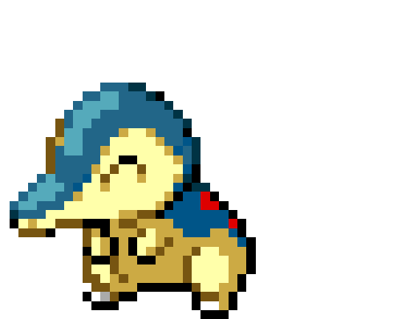
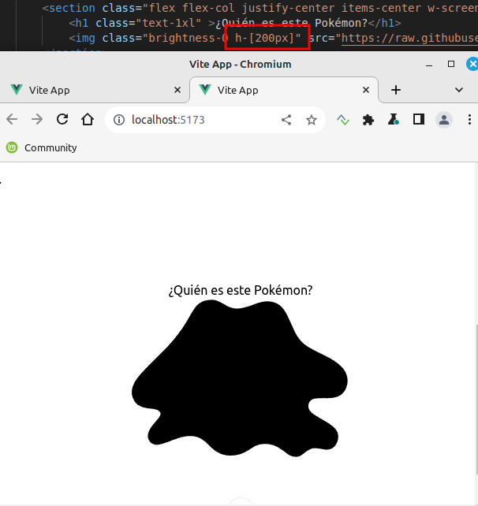

## Reto 3

<div align="center">
    
    
    
    
</div>

----------

PokemonPicture.vue

    Lo que vamos a hacer en este componente es importar directamente desde PokeApi una imagen de un pokemon (Ditto para ser más exactos).
    Siguiendo la misma forma que en PokemonGame.vue de las secciones, en este componente nos crearemos una sección que contendrá una imagen del pokemon Ditto. (No es necesario realizar la conexión directamente a la API, copia y pega la url de la imagen y muéstrala).


Ahora bien, nosotros queremos que inicialmente la imagen de nuestro Pokémon esté completamente oculta como en la imagen del resultado final, ¿cómo hacemos esto? utilizando una clase de Tailwind CSS llamada brightness-0. Comprueba que la imagen de tu Pokémon ahora mismo esté completamente negra. Añade también la clase h-[200px], ¿para qué sirve?

`Al añadir la clase brightness-0`


`Al añadir también la clase h-[200px]`



Aumentó el tamaño.

--------

Ahora, mediante clases css de tailwind, dale aspecto de botones a esa lista. Recuerda que para aplicar clases de Tailwind desde la etiqueta de styles tendrás que usar @apply. ¿Lo conseguiste?


```html
<style scoped>

button {
    @apply bg-white hover:bg-gray-100 text-gray-800 font-semibold py-2 px-4 border border-gray-400 rounded shadow;
}


</style>
```
`El color de fondo de nuestra aplicación es: #f1f1f1, para aplicarlo, ¿dónde debes colocar el código css correspondiente? aplícalo y muestra los cambios.`

En mi caso puse con css el background y lo apliqué a App.vue
```css
body {
    background-color: #f1f1f1;
}
```


