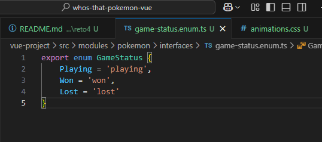
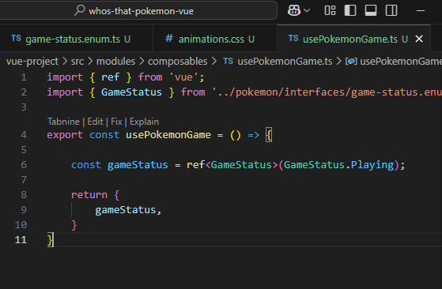
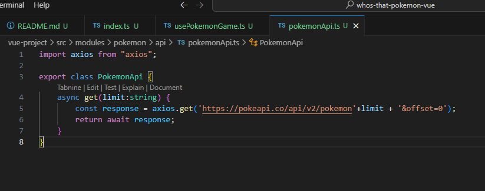
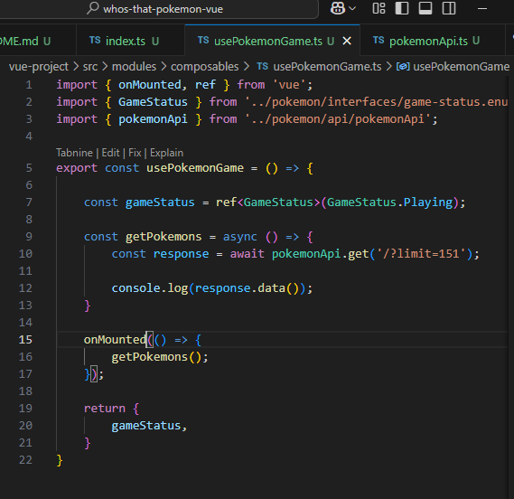
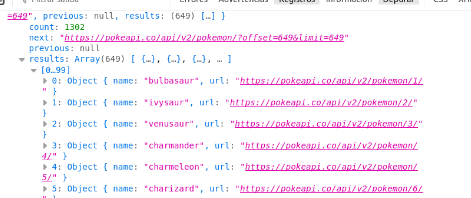
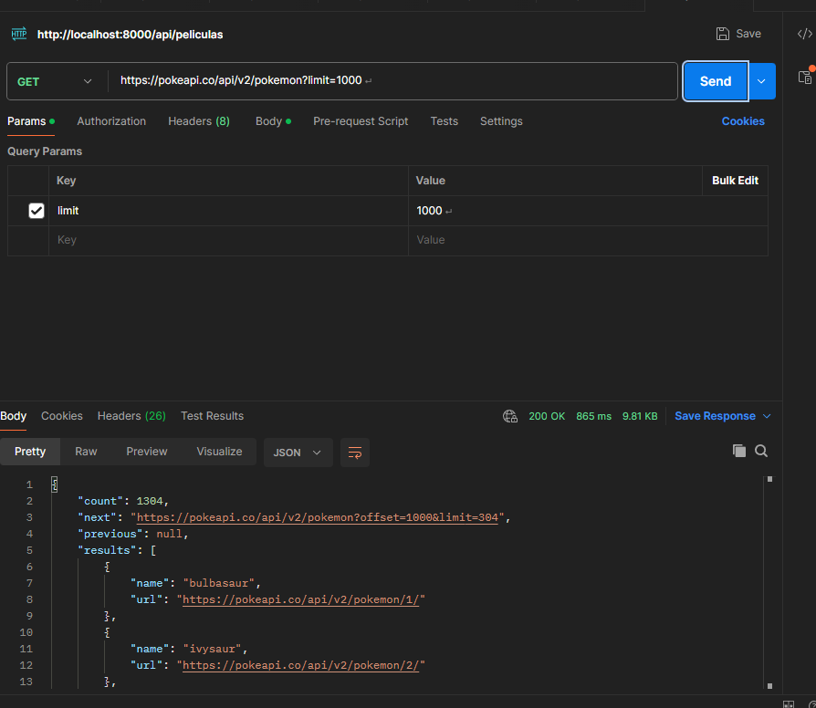
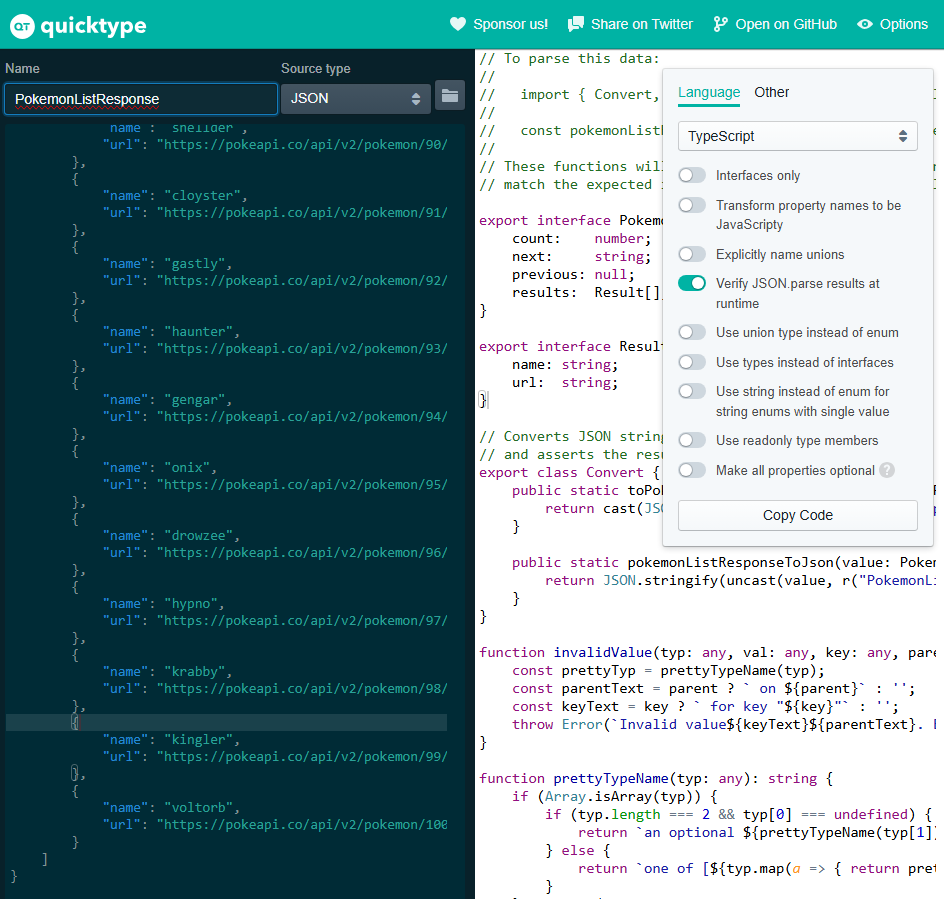

## Reto 4

<div align="center">
    
    
    
    
</div>

----------

En primer lugar vamos a crear un archivo que vamos a llamar usePokemonGame.ts dentro de la carpeta de composables.  

Nuestro juego va a tener 3 estados: gana, pierde y jugando. Estos estados los vamos a almacenar en una propiedad reactiva. Como vamos a tener que usar estos estados, lo mejor va a ser que nos creemos una interfaz.



__¿Qué es un archivo barril?__  
En lugar de importar directamente desde varios archivos individuales, el archivo barril reexporta todas las funcionalidades desde un único archivo. Esto ayuda a mejorar la organización del código y hace que las importaciones sean más legibles y fáciles de manejar.

  

__¿qué es lo que estamos haciendo con el código hasta ahora?__  
Estamos creando una referencia del estado del juego  

__Ahora, vamos a conectarnos con nuestra PokeApi para poder recuperar una lista con los pokemons que vamos a usar en nuestro juego. Para ello, vamos a utilizar Axios. ¿Qué es Axios? ¿Lo has usado antes?__  
Axios se basa en promesas para poder hacer fetch de una api.  

Dentro de la carpeta de pokemon crea una nueva llamada api y crea un archivo pokemonApi.ts. 

Instalamos axios en el proyecto, para ello usamos: 

bash
```
npm install axios
```

Dentro de la carpeta pokemon creamos una llamada api y creamos archivo PokemonApi.ts Realizamos conexion con pokeapi  

  

Ahora implementamos la llamada a la api en usePokemonGame.ts y comprobamos en consola el correcto funcionamiento: 

  

  

Ahora vamos a tiparlo para quedarnos con los resultados que desemos. 

- Abre Postman.
- Realiza una petición a PokeApi (no importa cuantos pokemon recuperes, puedes poner por ejemplo 1000). 
- Copia el código de la respuesta.
- Vuelve a Visual Studio y dentro de la carpeta de interfaces crea un archivo llamado pokemon-list.response.ts.
- Usa la extensión de Paste JSON as Code y ponle a nivel superior: PokemonListResponse  y dale a enter. De esta manera tenemos guardados los resultados de nuestra petición.
- Exporta este nuevo archivo en nuestro archivo de barril.

 
 

