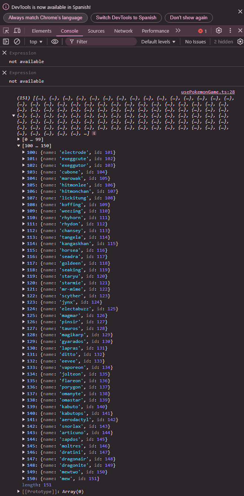
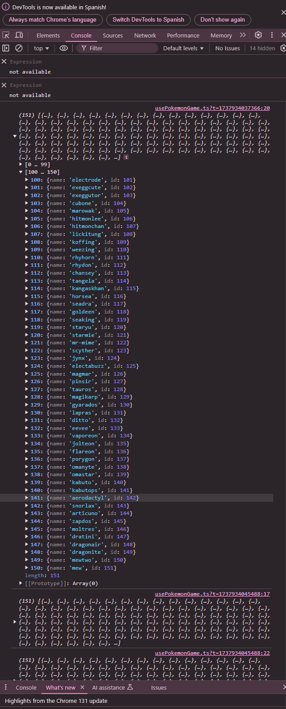

## Reto 5

<div align="center">
    
    
    
    
</div>

----------

Vamos a modificar el método getPokemons que hemos creado en el archivo usePokemonGame.ts, creemos una interfaz con los datos que nos interesan:

```typescript
export interface Pokemon {
    id: number;
    name: string;
}
```

Importamos esto en usePokemonGame y modificamos el metodo

```typescript
const getPokemons = async (): Promise<Pokemon[]> => {
        const response = await pokemonApi.get<PokemonListResponse>('/?limit=151');

        const pokemonsArray = response.data.results.map( pokemon => {
            const urlParts = pokemon.url.split('/');
            const id = urlParts[urlParts.length - 2] ?? 0;
            return {
                name: pokemon.name,
                id: +id,
            }
        });

        return pokemonsArray;
    }
```

__¿Qué es lo que estamos haciendo? ¿Para qué sirve la línea de código: const id = urlParts[urlParts.length - 2] ?? 0;?__  

Esta línea asegura que se obtenga el ID del Pokémon directamente desde su URL.

  

El resultado ahora nos muestra una lista de los 151 pokemons ordenados según su id. 
En nuestro caso nos interesa que sea aleatorio, una forma podría ser la siguiente

Para desordenarlo podemos usar el método sort y Math.random: 

```typescript
pokemonsArray.sort(() => Math.random() - 0.5);
```

Con ello, lo hemos logrado:  

  
