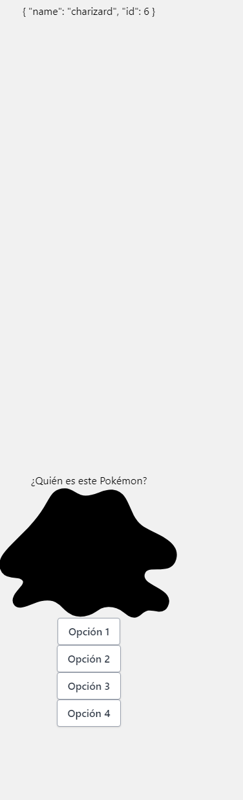
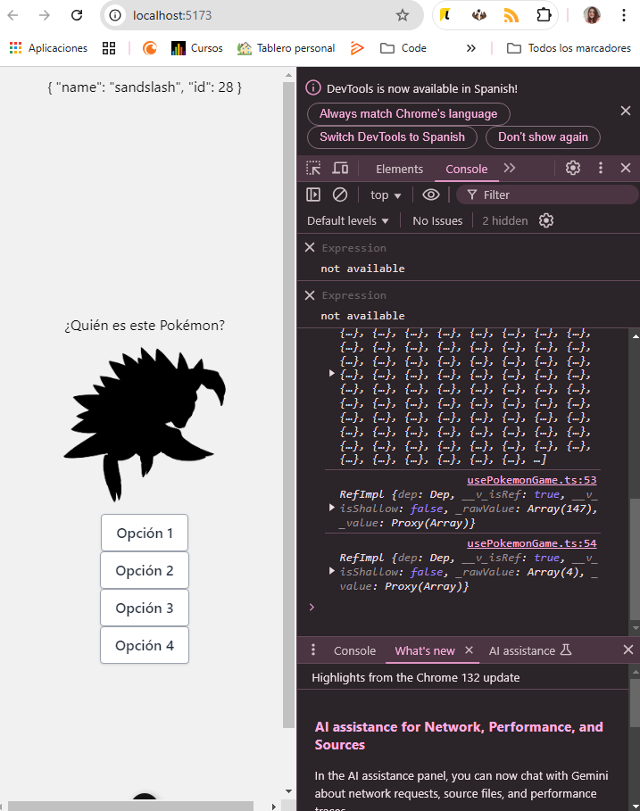
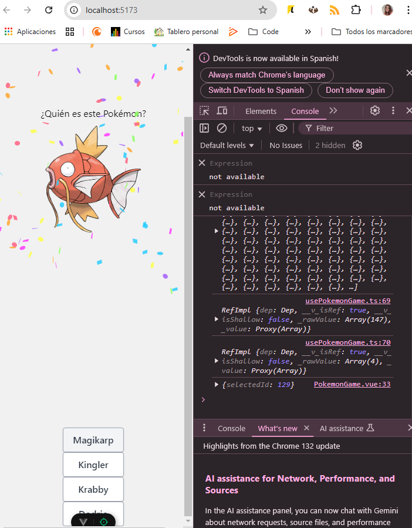

## Reto 6

<div align="center">
    
    
    
    
</div>

----------


## Determinando Propiedades Computadas

Para continuar con nuestro proyecto, necesitamos definir varias propiedades computadas que nos ayudarán a manejar el estado de la aplicación. Un ejemplo importante es determinar cuándo la página está cargando.

Cuando realizamos una petición HTTP para obtener los datos de los Pokémon, hay un momento en el que la información aún no ha llegado. Para manejar este estado, podemos crear una propiedad computada que se actualice automáticamente.

---

## ¿Qué es una Propiedad Computada?

En `usePokemonGame.ts`, creamos una nueva propiedad computada llamada `isLoading` de la siguiente forma:

```ts
const isLoading = computed(() => pokemonList.value.length === 0);
```

Con esto, determinamos si el array de Pokémon está vacío o no. Gracias a esta propiedad, podemos mostrar o esconder información dependiendo del estado de carga.

Por ejemplo, en `PokemonGame.vue`, podemos mostrar el mensaje *"Espere por favor"* y *"Cargando Pokemons"*:

```vue
<p v-if="isLoading">Espere por favor...</p>
<p v-else>Cargando Pokemons...</p>
```

Fíjate cómo hemos utilizado `v-if` con la propiedad computada y `v-else` para mostrar información alternativa cuando el estado cambie.  
  


---


## Simulación del Retraso de Carga

El cambio de estado puede ser demasiado rápido y casi imperceptible. Para visualizar mejor el cambio, podemos añadir un pequeño retraso utilizando `setTimeout` en `onMounted()` dentro de `usePokemonGame.ts`:

```ts
onMounted(() => {
  setTimeout(() => {
  }, 1000);
});
```

Tras comprobar que funciona correctamente, podemos eliminar este retraso, ya que no es necesario en producción.

---

## Creando una Propiedad Reactiva: `pokemonOptions`

Ahora vamos a definir una propiedad reactiva llamada `pokemonOptions`. Esta contendrá las opciones de los Pokémon que mostraremos al usuario.

En `usePokemonGame.ts` añadimos:

```ts
const pokemonOptions = ref<Pokemon[]>([]);
```

Podemos mostrar por consola `pokemonOptions.value` para asegurarnos de que efectivamente devuelve cuatro opciones de Pokémon como propiedades reactivas.

---

## Determinando el Pokémon Correcto

Para determinar qué Pokémon es el correcto, creamos una propiedad computada en `usePokemonGame.ts`:

```ts
const randomPokemon = computed(() => {
  const randomIndex = Math.floor(Math.random() * pokemonOptions.value.length);
  return pokemonOptions.value[randomIndex];
});
```

De esta forma, seleccionamos un Pokémon al azar dentro de las opciones disponibles.

A continuación, añadimos este valor a nuestro componente:

```vue
<h3>{{ randomPokemon.name }}</h3>
```

Verifica en la consola que el Pokémon que aparece en pantalla está dentro de la lista de opciones y que no siempre es el primer elemento.

---



## Mostrando la Imagen del Pokémon

El siguiente paso es obtener la imagen correspondiente del Pokémon seleccionado.

En `PokemonGame.vue`:

```vue
<PokemonPicture :pokemon-id="randomPokemon.id" />
```

En `PokemonPicture.vue`, definimos las `props`:

```ts
<script setup lang="ts">
interface Props {
  pokemonId: number;
}
const props = defineProps<Props>();
</script>
```

Luego, hacemos el `bind` del atributo `src` de la imagen usando una propiedad computada:

```ts
const pokemonImage = computed(() =>
  `https://raw.githubusercontent.com/PokeAPI/sprites/master/sprites/pokemon/other/official-artwork/${props.pokemonId}.png`
);
```

Finalmente, en el `template`, vinculamos la imagen al `src`:

```vue
<template>
  <section>
    
  </section>
</template>
```



---

## Mostrando la Imagen Original al Acertar

Ahora crearemos otra propiedad computada que muestre la imagen original si el usuario ha seleccionado la opción correcta.


Con esto, la imagen se actualizará dependiendo de si el jugador ha seleccionado correctamente el Pokémon.

---

  

-----  

## Confeti cuando aciertas   

## Implementación de Confetti en el Juego Pokémon

### Objetivo

Cuando el jugador adivina correctamente el Pokémon, queremos mostrar una animación de confetti para celebrar la victoria.

### Instalación de la librería `canvas-confetti`

Primero, instalamos la librería `canvas-confetti`, que nos permite generar animaciones de confetti en el navegador.

```bash
npm install canvas-confetti
```

Luego, agregamos los tipos necesarios para TypeScript:

```
npm i --save-dev @types/canvas-confetti
```

Implementación en el Componente de Juego   

En el componente principal del juego, cuando el jugador selecciona la respuesta correcta, cambiamos el estado del juego a Won y lanzamos la animación de confetti.

```
import confetti from 'canvas-confetti';
````

```vue

const onSelectedOption = (selectedId: number) => {
  console.log({ selectedId });

  if (selectedId === randomPokemon.value.id) {
    gameStatus.value = GameStatus.Won;
    showPokemon.value = true;
    confetti({
        particleCount: 300,  // Número de partículas
        spread: 150,         // Ángulo de dispersión
        origin: {            // Ubicación desde donde se lanzan las partículas
          y: 0.6
        }
      });
  } else {
    gameStatus.value = GameStatus.Lost;
  }
};
```

 

## Bloquear botones si el jugador pierde: 
Ahora vamos a tratar de que el jugador se le bloqueen las respuestas si ha perdido.  


